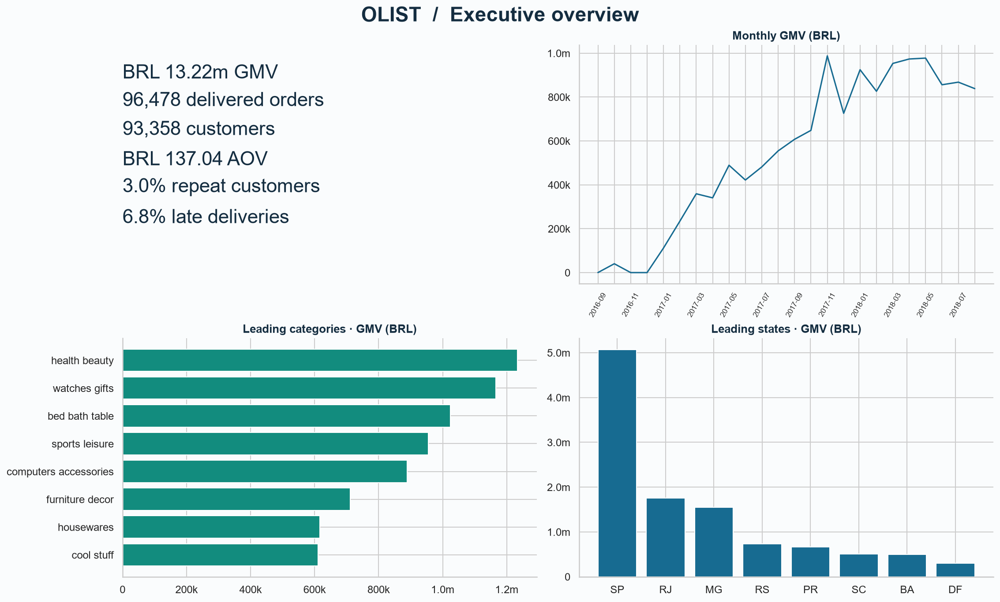

# E-Commerce Decision Intelligence
### Growth, Customer Value, Product Performance & Operational Risk
**Python · SQL · Power BI · Customer Analytics · Segmentation · Machine Learning**

How can an e-commerce marketplace grow merchandise value while improving customer value and post-purchase experience?

This project turns public Olist transactions into a validated reporting model, business KPIs, customer analytics, operational priorities and an honestly evaluated prediction case. Its central principle is **Volume × Rate × Business Impact**: commercial scale and normalized issue rates must be considered together.



## Findings at a glance

| Question | Validated result |
|---|---|
| How large is delivered commerce? | BRL **13.22m** merchandise GMV; **96,478** orders; **93,358** customers |
| How important is repeat purchasing? | **3.00%** observed repeat customers; **2.90%** of GMV from subsequent orders |
| Does an 80/20 customer rule hold? | About **45.00%** of customers generate 80% of GMV |
| Are late deliveries associated with poor reviews? | **62.42%** low reviews among late orders versus **9.26%** among on-time orders |
| Does the risk model support automated intervention? | Holdout AP **0.061** vs prevalence **0.035**, but precision only **6.22%** at the validation-selected threshold; **not deployment-ready** |
| Did the original notebook need correction? | Its item/payment join inflated payment value by **27.87%** |

These are historical observed outcomes, not causal claims, platform accounting revenue or future forecasts. Full definitions and denominators: [metric dictionary](docs/metric_dictionary.md). Recommendations and limitations: [executive summary](docs/executive_summary.md).

## Start here

1. [Data quality and modelling notebook](notebooks/01_data_quality.ipynb) — audits, join correction, reconciliations and dimensional tables.
2. [Business analytics notebook](notebooks/02_business_analytics.ipynb) — KPIs, growth bridge, category/seller/state scorecards, payment behavior, concentration and SQL parity.
3. [Customer analytics notebook](notebooks/03_customer_analytics.ipynb) — acquisition, cohorts, equal-follow-up second purchase, RFM and marketing hypotheses.
4. [Data science notebook](notebooks/04_data_science.ipynb) — clustering, leakage-aware temporal models, statistical comparisons and management recommendations.

The notebooks include executed outputs. Reusable calculations live in `src/`; explanations connect evidence to decisions instead of listing charts alone. The [original notebook review](docs/original_notebook_review.md) explains what was retained and corrected.

## Reproduce

Python 3.12 is recommended. From the project directory:

```bash
python -m venv .venv
# Activate .venv with your platform's activation command.
python -m pip install -r requirements.txt
python run_pipeline.py
python -m unittest discover -s tests -v
```

Put the eight public Olist CSV files in `data/raw/` first; see [data provenance and setup](data/README.md). This repository's existing `archive/` folder contains the source files: copy its CSV files into `data/raw/` before running the pipeline. Alternatively, download them from the original dataset source. New raw-data copies and large generated outputs are excluded by `.gitignore`. Run the pipeline to create the BI exports and SQLite database after cloning. `requirements-validated.txt` records the package versions used for this build.

Individual stages: `python run_pipeline.py --stage quality`, then `business`, `models`, `report`. Model fitting may take a few minutes. Random seed is 42. No credentials or private service connection is needed. All source data is public; the optional geolocation dataset is not used.

## What is delivered

```
notebooks/     Four executed analytical notebooks
src/           Grain-safe model, features, KPIs, visualizations, ML and SQL verification
sql/           Six executable SQLite analytical queries
powerbi/       Relationship model, Power Query, DAX, theme and four dashboard designs
output/        Generated BI tables, SQLite database, audits and analytical results
images/        Business charts and model diagnostics
docs/          Metric contract, executive summary, source notebook review and validation
tests/         Regression tests for join expansion, chronology, keys and censoring
data/          Provenance manifest, setup and ignored local input files
```

Running the pipeline creates `FactOrders`, `FactOrderItems`, `DimCustomer`, `DimProduct`, `DimSeller` and `DimDate`; optional payment/review audit facts remain separate. All amounts reconcile before any commercial filters. Eighteen SQL/Python checks cover executive, monthly, customer, category, seller and retention results. See the [validation record](docs/validation.md). The original root notebook is retained for provenance; start with the four rebuilt notebooks above.

## Analytical choices that matter

- Delivered-only commerce uses merchandise prices, not payment totals repeated across items.
- Each rate has its own eligible denominator; missing outcomes never become successful outcomes.
- Distinct category/seller orders are not additive when an order spans several groups.
- Cohorts distinguish observable zero from unobservable follow-up; 90-day second purchase uses matured customers.
- RFM preserves tied frequency. Clustering largely recovers repeat versus one-time buyers and adds limited value beyond that simple rule.
- Priority scorecards expose counts, confidence bounds, GMV exposure and thresholds rather than implying precise financial losses.
- Risk prediction uses time splits and purges outcomes that were unavailable at split boundaries. The weak holdout precision is a substantive result, not hidden behind accuracy.
- Statistical differences and feature importance are not causal explanations.

## Power BI scope

The [Power BI package](powerbi/README.md) contains proposed DAX, a relationship diagram, Power Query loader, theme and a detailed four-page dashboard specification with real-data previews. Generate the import-ready CSVs by running the pipeline. **It does not include a native `.pbix` file.** DAX and report interactions require validation in Power BI Desktop. Python and SQLite calculations have been executed separately.

## Public-data boundaries

The dataset has no usable return reasons, marketing channel spend, CAC, profit margins or total market-size information for this analysis. No churn model or fabricated return data is included. No confidential company data, code, figures or recommendations were used.

This project expands on analytical methods developed during an industry-focused retail analytics project in the ReDI School Data Analytics program. The analysis presented here uses exclusively public Olist data and contains no proprietary company information.

Source: [Olist dataset](https://www.kaggle.com/datasets/olistbr/brazilian-ecommerce), retrieved from this repository's [public-data mirror at the pinned commit](https://github.com/meroebeigi/E-Commerce/tree/41710981b96a59a5399d88c62339ede3c8207e46/archive). Source hashes are included. Follow the original dataset's license and attribution conditions when redistributing data.
