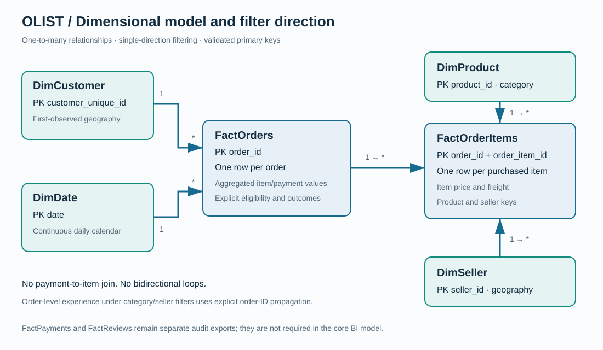
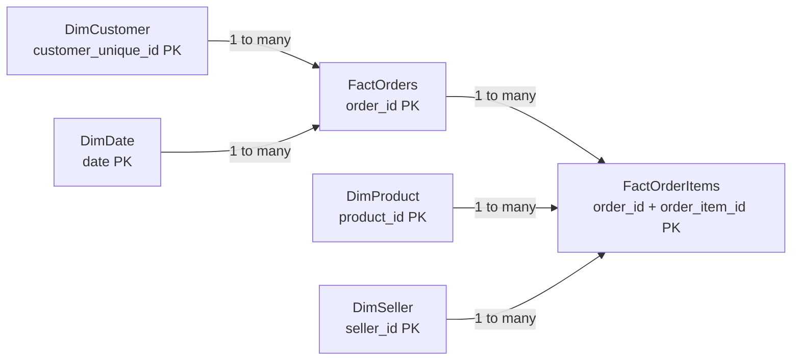

# Power BI implementation package

These are **Power BI-ready CSV exports, DAX, Power Query and four rendered dashboard designs**. A native `.pbix` has not been created or executed in Power BI Desktop. Python/SQLite validation does not establish DAX-engine validation.

1. Run the pipeline and open Power BI Desktop.
2. Create a text parameter `OutputFolder` pointing to this project's `output` folder (ending in a path separator).
3. Use `import_tables.pq` as a function called `LoadOlist`. Create one query per required table: `= LoadOlist("FactOrders")`, etc.
4. Set the explicit data types described below; disable automatic relationship detection and create only the documented relationships.
5. Mark `DimDate[date]` as the date table, sort month names by month number and year-month by date, and import `theme.json`.
6. Add the measures in `dax_measures.md`, create the pages in `dashboard_specification.md`, and verify card values against `output/kpis.csv`.
7. Recheck a single-category and single-seller selection against `categories.csv` and `sellers.csv`. Those slicers need the explicit order-ID propagation measures; do not switch all relationships to bidirectional.

### Tables and relationships

| Table | Grain / primary key | Relationship | Direction |
|---|---|---|---|
| DimCustomer | One `customer_unique_id` | 1 → * FactOrders.customer_unique_id | Dimension to orders |
| DimDate | One `date` | 1 → * FactOrders.purchase_date | Dimension to orders |
| FactOrders | One `order_id` | 1 → * FactOrderItems.order_id | Orders to items |
| DimProduct | One `product_id` | 1 → * FactOrderItems.product_id | Dimension to items |
| DimSeller | One `seller_id` | 1 → * FactOrderItems.seller_id | Dimension to items |
| FactOrderItems | One (`order_id`, `order_item_id`) | Many-side of three relationships above | No outgoing filters |

Actual row counts and schemas are written to `output/model_inventory.csv`. This is a fact constellation with an order-header/detail relationship, resembling a star schema; it is not a single flat fact table. Avoid a second date/customer relationship into items, which would create redundant paths. FactPayments and FactReviews are audit outputs; keep them out of the initial BI model.

### Data types

Keep all IDs and ZIP prefixes as text. Use Date for purchase_date, first_purchase_date and DimDate.date; Date/Time for timestamp fields; Fixed Decimal Number for price/freight/payment/merchandise; Whole Number for item counts and date components. Use True/False for flags, preserving null `is_late` and `low_review`. Blank outcomes must not become false. `import_tables.pq` supplies these conversions for the main six tables.

For optional RFM and cluster slicers, merge `customers.csv` and `customer_clusters.csv` into DimCustomer by unique customer ID in Power Query. Keep the unique grain. These are full-window snapshot segments; they do not recompute as-of each historical month. Label them accordingly. Import cohort and 90-day result tables as disconnected snapshots and do not connect them to the daily date slicer without a separately designed cohort model.

Single-direction filtering and virtual propagation follow [Microsoft's relationship documentation](https://learn.microsoft.com/en-us/power-bi/transform-model/desktop-relationships-understand). `TREATAS` is used explicitly where item-level filters must restrict order-level experience measures.
